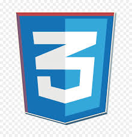
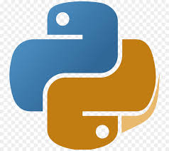

---
# the default layout is 'page'
icon: fas fa-info-circle
order: 4
---

<!-- > Add Markdown syntax content to file `_tabs/about.md`{: .filepath } and it will show up on this page.
{: .prompt-tip } -->

## Skills & Projects

### Languages & Frameworks:
- **Languages:** Java, HTML, CSS, JavaScript, TypeScript, Python, EJS
- **Frameworks:** React.js, Node.js, Express
- **Technologies:** AWS, Docker
- **Database:** SQL, MongoDB

### Skills Matrix:
| Languages        | Frameworks         | Technologies     | Databases  |
|------------------|--------------------|------------------|------------|
|       |    |   |   |

### Projects:
1. **Operating System Project**
   - **Tech Stack:** HTML, CSS, JavaScript
   - **Description:** An interactive website illustrating 4 operating system algorithms: First In First Out (FIFO), Shortest Job First (SJF), Look/Clook, and Dining Philosopher. Includes user input-based simulation of algorithms.

2. **Clothing Brand Website**
   - **Tech Stack:** HTML, CSS, JavaScript
   - **Description:** Wave Clothing Brand's web technology project, featuring a user-friendly and visually engaging website with seamless navigation and advanced animations using technologies like Locomotive Scroll and GSAP.

3. **WanderLust: Travel Accommodation Platform**
   - **Tech Stack:** Node.js, Express.js, MongoDB, EJS
   - **Description:** Comprehensive accommodation booking platform inspired by Airbnb. Implemented RESTful APIs for seamless communication between frontend and backend components. Included user authentication and authorization using PASSPORT and validation using JOI. Followed MVC architecture.

   ### Project Timeline:
- **Operating System Project** 
  - An interactive website illustrating 4 operating system algorithms.
  -   
- **Clothing Brand Website** 
  - Wave Clothing Brand’s web technology project, a user-friendly and visually engaging website.
  -   
- **WanderLust: Travel Accommodation Platform** 
  - Comprehensive accommodation booking platform inspired by Airbnb.
  -    

### Education & Experience:
- **Education:** Bachelor of Technology in Computer Engineering from Pandit Deendayal Energy University, Current GPA: 9.34/10
- **Experience:** Web Developer Intern at Skill3d.in, Made a website for a startup in additive manufacturing using HTML, CSS, JS

### Leadership Roles:
- **Associate International Service Director:** Rotaract Club Of Kankaria Ahmedabad
  - Spearheaded international service projects, collaborating with partner organizations and clubs worldwide to address pressing global issues.
- **Treasurer:** Synergy– The Entrepreneurship Club, PDEU
  - Managed the club's financial operations, including budget planning and expense tracking. Developed and maintained financial reports and records to ensure transparency and accountability.
